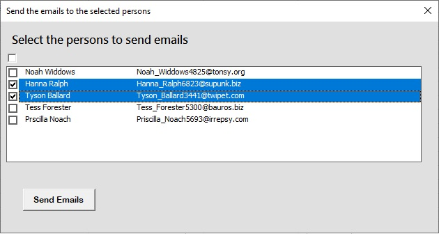

# Excel Sample Projects

Sample Excel projects with VBA code to demonstrate different use cases.

## The workbook SendEmail.xlsm

You can send the emails from the workbook suing your Outlook account. If you have installed Microsoft Office (e.g. Microsoft 365) on your Windows and you have a user account is same as one of the Outlook's accounts, then the workbook sends emails using those account.

Open the workbook, write the persons data in the sheet **paersons** and click on the button **Send Email**. You can expect to see this user form on the screen:

The VBA code is locked by a password to prevent lazy people from the trivial copy/paste action :). You can find the code and step-by-step instructions on how to create this workbook in this article:

[How to Send Email from Excel Using VBA](https://expknow.com/how-to-send-email-from-excel-using-vba/)
